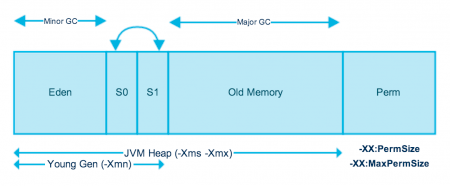

# JVM

### Properties

JVM arguments

- command line arguments

System properties (Environment variables)

- OS level properties 

### JVM Memory 

###### Links:

https://www.journaldev.com/2856/java-jvm-memory-model-memory-management-in-java

###### Running jar files:

    java -jar jar-file-name [args …]
    java -Xmx50m -Xms20m -jar datacollector.jar -Dspring.profiles.active=test

###### Memory model:

    Young generation (heap) -> Old generation (heap) -> PermGen (Metaspace) (non-heap)

Young Generation is divided into three parts – Eden Memory and two Survivor Memory spaces.

###### Heap size:

    -Xmx50m   -> maximum heap isze
    -Xms20m   -> minimum heap size
    -Xmn10m   -> size of the Young Generation, rest of the space goes for Old Generation.

###### PermGen DEPRECATED (permanent generation):

    -XX:PermSize=50m       -> is the initial or minimum size of the PermGen space
    -XX:MaxPermSize=50m    -> is the maximum size

###### Metaspace (replaces PermGen from java 8+):

    -XX:MetaspaceSize=[size]           -> Initiali size
    -XX:MaxMetaspaceSize=[size]        -> Max size
    -XX:MinMetaspaceFreeRatio=[size]
    -XX:MaxMetaspaceFreeRatio=[size]

All the Garbage Collections are “Stop the World” events because all application threads are stopped until the operation completes. Can cause timeouts.

### Monitoring

VisualVM - RAM, CPU and Threads monitoring

